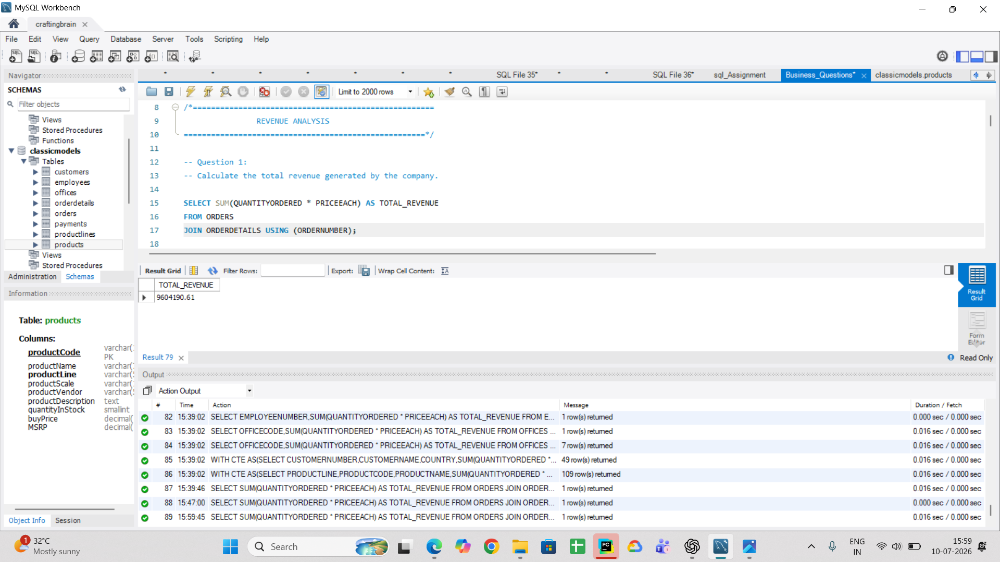
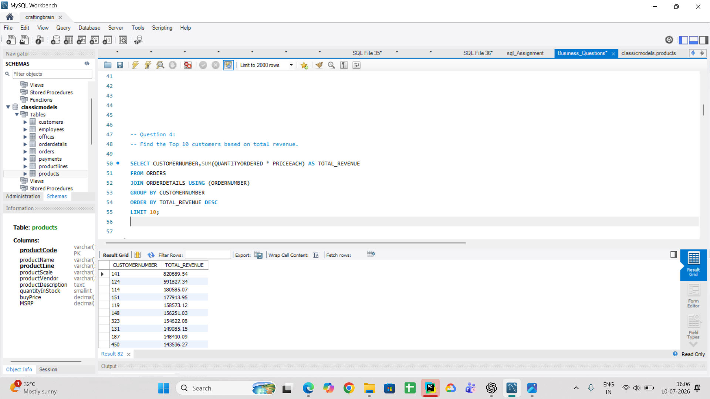
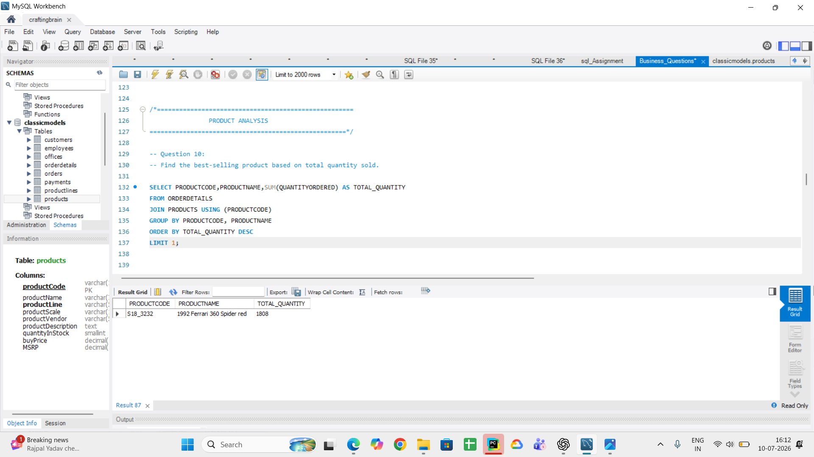
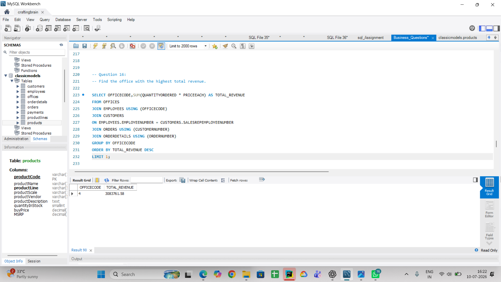
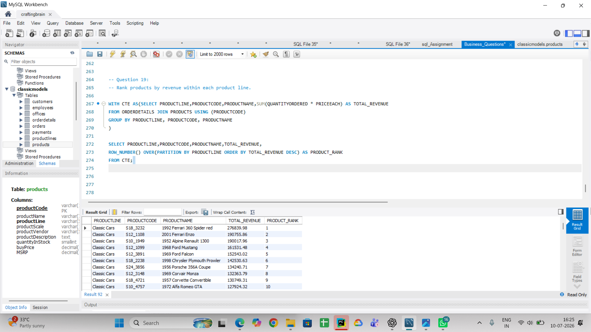
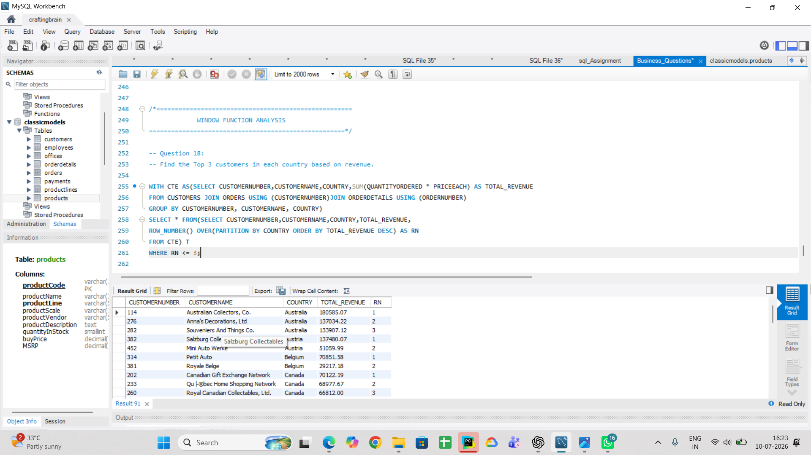

# 🛍️ Retail Sales & Customer Revenue Analysis using SQL

A business-oriented SQL analytics project built using the ClassicModels database to analyze revenue, customers, products, employees, and sales performance through real-world business questions.


## 📌 Project Overview

This project analyzes the **ClassicModels** database using SQL to answer real-world business questions related to sales, customers, products, employees, and office performance.

The objective of this project is to demonstrate SQL skills commonly required for Data Analyst roles by solving practical business problems using joins, aggregate functions, Common Table Expressions (CTEs), and window functions.

---

## 🎯 Objectives

- Analyze overall business revenue.
- Identify high-value customers.
- Evaluate product performance.
- Measure employee and office sales performance.
- Apply SQL to solve business-oriented analytical problems.
- Generate business insights from query results.

---

## 🛠️ Tools & Technologies

- MySQL
- MySQL Workbench
- SQL
- ClassicModels Database

---

## 💡 SQL Concepts Demonstrated

- SELECT
- WHERE
- GROUP BY
- ORDER BY
- Aggregate Functions (SUM, AVG, COUNT)
- INNER JOIN
- LEFT JOIN
- Common Table Expressions (CTEs)
- Window Functions
- ROW_NUMBER()
- LIMIT
- Business-Oriented SQL Queries

---

## 📊 Business Questions Solved

### Revenue Analysis

1. Calculate the total revenue generated by the company.
2. Find total revenue generated by each country.
3. Find total revenue generated by each product line.
4. Find the Top 10 customers by revenue.

### Customer Analysis

5. Find the highest paying customer.
6. Find the average payment made by each customer.
7. Find customers whose total payment is above the average customer payment.
8. Find customers without any orders.
9. Find customers with the highest number of orders.

### Product Analysis

10. Find the best-selling product.
11. Find the lowest-selling product.
12. Find the highest revenue product in each product line.
13. Find the average revenue generated by each product line.
14. Find the Top 3 products by revenue.

### Employee Analysis

15. Find the employee whose customers generated the highest revenue.
16. Find the office with the highest revenue.
17. Calculate revenue generated by each office.

### Window Function Analysis

18. Find the Top 3 customers in each country by revenue.
19. Rank products by revenue within each product line.

---

## 📂 Project Structure

```
SQL_Retail_Sales_Analysis/
│
├── Business_Questions.sql
├── Business_Insights.md
├── README.md
├── Results/
│   ├── CSV outputs
│
└── Screenshots/
    ├── Query result screenshots
```

---

## 📈 Project Outcomes

- Performed revenue analysis across countries and product lines.
- Identified high-value customers based on payments and revenue.
- Analyzed product performance using quantity sold and revenue.
- Evaluated employee and office sales performance.
- Applied CTEs and Window Functions for advanced business analysis.
- Generated actionable business insights from SQL query results.

---

## 📷 Project Outputs

The repository contains:

- SQL query scripts
- Query result screenshots
- Exported Excel result files
- Business insights
- Documentation

---

## 🚀 Skills Demonstrated

- SQL Query Writing
- Business Analysis
- Data Aggregation
- Data Exploration
- Relational Database Analysis
- Window Functions
- Common Table Expressions (CTEs)
- Analytical Thinking
- Data Interpretation

---

## 📌 Database

**ClassicModels Sample Database**

The project uses the ClassicModels relational database to simulate business scenarios involving customers, orders, products, employees, offices, and payments.

---

## 📸 Project Screenshots








## ⭐ Project Highlights

- Solved 19 real-world business SQL problems.
- Performed revenue, customer, product, and employee analysis.
- Used CTEs and Window Functions for advanced analytics.
- Exported results in Excel format.
- Documented business insights and findings.

## 👩‍💻 Author

**Sowjanya Hanumanla**

Aspiring Data Analyst | SQL | Python | Power BI | Excel
